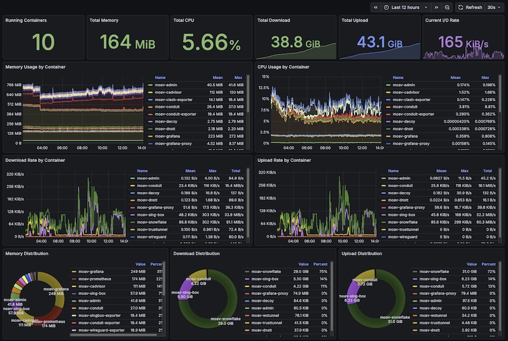

# MoaV Monitoring Stack

Real-time observability for your MoaV deployment with Grafana dashboards.

 <a href="../site/demos/grafana-dashboards.webm">(demo video)</a>

## Overview

The monitoring profile provides:
- **Prometheus** - Time-series database for metrics storage (15-day retention)
- **Grafana** - Beautiful dashboards for visualization
- **Node Exporter** - System metrics (CPU, RAM, disk, network)
- **cAdvisor** - Container metrics per service
- **Clash Exporter** - sing-box proxy metrics via Clash API
- **sing-box Exporter** - Per-user connections, protocol breakdown, GeoIP country stats
- **Xray Exporter** - Per-user connections and traffic (upload/download), GeoIP country stats
- **WireGuard Exporter** - VPN peer and traffic metrics, GeoIP country labels
- **AmneziaWG Exporter** - Per-peer traffic metrics, GeoIP country labels
- **Telemt Exporter** - MTProxy pool health, DC availability, upstream quality
- **Snowflake Exporter** - Tor donation metrics (people served, bandwidth donated)
- **GeoIP Database** - [DB-IP Lite](https://db-ip.com/db/lite.php) country database for offline IP-to-country lookups

## Quick Start

```bash
# Start with monitoring profile
moav start monitoring proxy admin

# Or add to existing deployment
moav start monitoring
```

## Access

| Service | URL | Credentials |
|---------|-----|-------------|
| Grafana | `https://your-server:9444` | admin / ADMIN_PASSWORD |

Login with username `admin` and the password you set in your `.env` file (`ADMIN_PASSWORD`).

## Pre-built Dashboards

### MoaV - System

<!-- Screenshot: System dashboard (CPU/Memory gauges and graphs) -->

System-level metrics from Node Exporter:
- CPU usage (gauge + time series)
- Memory usage (gauge + time series)
- Disk usage
- Network I/O (receive/transmit)
- System load (1m, 5m, 15m)
- Uptime

### MoaV - Containers

<!-- Screenshot: Containers dashboard (per-container resource usage) -->

Per-container metrics from cAdvisor:
- Running container count
- Total memory and CPU usage
- Memory usage by container (stacked)
- CPU usage by container (stacked)
- Network download/upload by container
- Distribution pie charts
- Summary table with all metrics

### MoaV - sing-box

<!-- Screenshot: sing-box dashboard (connections and traffic) -->

Proxy metrics via Clash Exporter:
- Active connections
- Total upload/download traffic
- Memory usage
- Connections over time
- Traffic rate (upload/download)
- Connections by inbound type (pie chart)

### MoaV - WireGuard

<!-- Screenshot: WireGuard dashboard (peer metrics) -->

VPN metrics from WireGuard Exporter:
- Total peers
- Last handshake time
- Total received/sent bytes
- Traffic rate per peer
- Peer details table (name, public key, allowed IPs, traffic, last handshake)

### MoaV - Snowflake

<!-- Screenshot: Snowflake dashboard (donation metrics) -->

Tor donation metrics from Snowflake Exporter:
- People served (total connections helped)
- Total download bandwidth donated
- Total upload bandwidth donated
- Total bandwidth donated
- Connections over time
- Bandwidth over time

> The Snowflake exporter follows the relay (1.8.2: profile membership moved from `[monitoring, all]` to `[snowflake, all]`). When `ENABLE_SNOWFLAKE=false` the exporter stays off too, so the Snowflake panels won't emit stale data.

### MoaV - Conduit

Psiphon donation metrics:

- **Live bandwidth** (`conduit_bytes_downloaded` / `conduit_bytes_uploaded`) — in-memory gauges, reset on every Conduit container restart.
- **Lifetime bandwidth** (`conduit_bytes_downloaded_lifetime` / `conduit_bytes_uploaded_lifetime`) — Prometheus recording rule that adds a per-install offset to the live counters, so cumulative donation totals survive restarts.
- **Connected clients** + per-region splits.

## Conduit lifetime bandwidth

The lifetime gauges depend on two pieces that ship together (1.7.9+):

1. **Recording rules** at `configs/monitoring/conduit_lifetime.rules.yml` — materialized from `conduit_lifetime.rules.yml.template` on first monitoring start (the live file is gitignored because it holds per-install offsets).
2. **Offset auto-updater** (`scripts/update-conduit-offsets.sh`) — banks the running total into the offset just before a Conduit restart wipes the live gauges, then SIGHUPs Prometheus to reload the rule.

A **systemd watcher** (`moav-conduit-offsets.service`) reacts to Conduit `start` events and runs the updater automatically with a settle delay. `moav start` auto-installs the watcher the first time Conduit + monitoring run together — opt out with `CONDUIT_OFFSETS_AUTOUPDATE=false`. Manage directly with [`moav conduit-offsets {install|uninstall|status}`](CLI.md#moav-conduit-offsets). Hosts without systemd skip the watcher silently; run the updater from cron or by hand after each Conduit restart instead.

## GeoIP Country Distribution

All four protocol dashboards (sing-box, Xray, WireGuard, AmneziaWG) include a "Geographic Distribution" row showing user connections by country.

### How it works

- A shared [DB-IP Lite Country](https://db-ip.com/db/lite.php) database (~5MB) provides offline IP-to-country lookups — no external API calls at runtime
- **sing-box**: polls the Clash API (`/connections`) for source IPs of active connections
- **Xray**: extracts source IPs from Xray access logs
- **WireGuard / AmneziaWG**: reads endpoint IPs from `wg show` / `awg show`
- Country codes are ISO 3166-1 alpha-2 (e.g., `IR`, `DE`, `US`)

### Setup

The GeoIP database must be downloaded once before country metrics appear:

```bash
# Download the GeoIP database (run once, or monthly to refresh)
docker compose --profile setup run --rm geoip-updater
```

The database is stored in a Docker volume (`moav_geoip`) and shared read-only with all exporters.

### Refreshing the database

DB-IP Lite is updated monthly. To refresh:

```bash
docker compose --profile setup run --rm geoip-updater
docker compose restart singbox-exporter xray-exporter wireguard-exporter amneziawg-exporter
```

### Using MaxMind GeoLite2 instead

The database format is MMDB — compatible with both DB-IP and MaxMind. To use MaxMind GeoLite2-Country instead:

```bash
# Download GeoLite2-Country.mmdb from maxmind.com (requires free account)
# Copy into the volume:
docker run --rm -v moav_geoip:/geoip -v /path/to/GeoLite2-Country.mmdb:/src/db.mmdb alpine \
  cp /src/db.mmdb /geoip/dbip-country-lite.mmdb
```

### Graceful degradation

If the GeoIP database is not downloaded, all country lookups return `"XX"` (unknown) and existing metrics continue to work normally. The exporters log a warning on startup:

```
GeoIP: could not load /geoip/dbip-country-lite.mmdb: [Errno 2] No such file or directory
```

## Configuration

### Port Configuration

```bash
# .env
PORT_GRAFANA=9444    # External Grafana port (default: 9444)
```

### Cloudflare CDN for Faster Grafana (Recommended)

Grafana can be slow to load over high-latency connections due to large JS/CSS assets. You can use Cloudflare's CDN to cache static assets for much faster loading.

**Step 1: Add DNS Record**

In Cloudflare Dashboard, add:

| Type | Name | Content | Proxy |
|------|------|---------|-------|
| A | grafana | YOUR_SERVER_IP | **Proxied** (orange cloud) |

**Step 2: Configure Environment**

Add to your `.env` file:
```bash
GRAFANA_ROOT_URL=https://grafana.yourdomain.xyz:2083
```

**Step 3: Restart Services**

```bash
moav restart grafana grafana-proxy
```

**Step 4: Access Grafana**

Access via `https://grafana.yourdomain.xyz:2083` instead of `:9444`.

> **Note:** Port 2083 is used because Cloudflare only proxies specific HTTPS ports (443, 2053, 2083, 2087, 2096, 8443). The `grafana-proxy` service handles SSL termination and caching headers.

**Benefits:**
- Static assets (JS, CSS, images) cached at Cloudflare edge
- Gzip compression
- Faster global access
- WebSocket support for live dashboard updates

### Retention

Prometheus retains data for **15 days** by default. To change this, modify the `--storage.tsdb.retention.time` flag in `docker-compose.yml`:

```yaml
prometheus:
  command:
    - '--storage.tsdb.retention.time=30d'  # 30 days
```

### Enabling/Disabling

```bash
# .env
ENABLE_MONITORING=true   # Set to false to disable
```

## Resource Usage

> **Warning**: The monitoring stack nearly doubles MoaV's resource requirements. While MoaV alone runs on 1 vCPU / 1GB RAM, adding monitoring requires at least **2 vCPU / 2GB RAM** for stable operation.

Approximate additional resources when monitoring is enabled:

| Component | CPU | RAM | Disk |
|-----------|-----|-----|------|
| Prometheus | 0.1-0.3 cores | 200-500 MB | ~50 MB/day |
| Grafana | 0.1-0.2 cores | 100-200 MB | ~50 MB |
| Node Exporter | <0.1 cores | ~20 MB | - |
| cAdvisor | 0.1-0.3 cores | 50-150 MB | - |
| Clash Exporter | <0.1 cores | ~30 MB | - |
| WireGuard Exporter | <0.1 cores | ~10 MB | - |
| Snowflake Exporter | <0.1 cores | ~10 MB | - |
| **Total** | **~0.5-1 cores** | **~400-900 MB** | **~1 GB/15 days** |

### Minimum Requirements

| Configuration | vCPU | RAM | Notes |
|---------------|------|-----|-------|
| MoaV only | 1 | 1 GB | Bare minimum |
| MoaV + Monitoring | 2 | 2 GB | Recommended (for stats & monitoring) |
| MoaV + Monitoring + All Profiles | 2 | 4 GB | Production recommended |

**If you have only 1GB RAM**, do not enable monitoring - it could cause hangs and crashes.

## Security

- **Prometheus** is internal only (no external port exposed)
- **Grafana** requires authentication via `ADMIN_PASSWORD`
- All exporters expose metrics only to the internal Docker network

## What's Not Included

The following services do not currently expose metrics:

| Service | Reason |
|---------|--------|
| **TrustTunnel** | No metrics API available |
| **dnstt** | No metrics API available |

Container-level metrics (CPU, memory, network) are still available for these services via cAdvisor.

## Troubleshooting

Run `moav doctor services` to quickly check if monitoring services are running. For detailed issues, see [TROUBLESHOOTING.md](TROUBLESHOOTING.md#monitoring-issues).

Common issues covered:
- System hangs after starting monitoring (RAM issues)
- Grafana shows "No Data"
- High memory usage from cAdvisor
- Snowflake metrics showing zeros
- WireGuard exporter not starting

## Blocked Registries (Iran, Russia, etc.)

If you're in a region where container registries are blocked (gcr.io, ghcr.io, Docker Hub), you can build images locally:

```bash
# Build commonly blocked images (cAdvisor from gcr.io, clash-exporter from ghcr.io)
moav build --local

# Build a specific image
moav build --local prometheus

# Build EVERYTHING locally (all services + all external images, no registry pulls)
moav build --local all
```

Available images for local build:
- `cadvisor` - Container metrics (gcr.io) **← commonly blocked**
- `clash-exporter` - Clash API exporter (ghcr.io) **← commonly blocked**
- `prometheus` - Time-series database (Docker Hub)
- `grafana` - Visualization dashboards (Docker Hub)
- `node-exporter` - System metrics (Docker Hub)
- `nginx` - Web server (Docker Hub)
- `certbot` - Let's Encrypt client (Docker Hub)

The build command automatically updates your `.env` to use the local images.

Alternatively, configure mirror registries manually in `.env`:
```bash
IMAGE_CADVISOR=mirror.example.com/cadvisor/cadvisor:latest
IMAGE_PROMETHEUS=mirror.example.com/prom/prometheus:latest
```

## CLI Commands

```bash
# Start monitoring only
moav start monitoring

# Start with other profiles
moav start monitoring proxy admin

# Build images locally (for blocked registries)
moav build --local

# View monitoring logs
moav logs prometheus
moav logs grafana

# Stop monitoring
moav stop prometheus grafana node-exporter cadvisor clash-exporter
```

## Customization

### Adding Custom Dashboards

Place JSON dashboard files in:
```
configs/monitoring/grafana/provisioning/dashboards/
```

Grafana automatically loads new dashboards within 30 seconds.

### Custom Prometheus Scrape Targets

Edit `configs/monitoring/prometheus.yml` to add new targets:
```yaml
scrape_configs:
  - job_name: 'my-custom-exporter'
    static_configs:
      - targets: ['my-service:9999']
```

Then reload Prometheus:
```bash
docker exec moav-prometheus wget -qO- --post-data='' http://localhost:9091/-/reload
```

## Architecture

```
 ┌─────────────────┐
 │  Cloudflare CDN │ (optional, for faster loading)
 └────────┬────────┘
          │                  
          ▼                         
 ┌─────────────┐  ┌─────────────┐       
 │grafana-proxy│  │   Grafana   │
 │ :2083 (CDN) │  │ :9444 direct│
 └──────┬──────┘  └──────┬──────┘
        │                │
        └───────┬────────┘
                │
         ┌──────▼──────┐
         │  Prometheus │ :9091 (internal)
         │ (time-series│
         │   storage)  │
         └──────┬──────┘
   ┌─────────┬──┴─────┬─────────┬─────────┐
   │         │        │         │         │
┌──▼────┐ ┌──▼───┐ ┌──▼────┐ ┌──▼────┐ ┌──▼──────┐
│ node  │ │cAdvsr│ │ clash │ │  wg   │ │snowflke │
│export │ │(cntr)│ │(sngbx)│ │(vpn)  │ │ (tor)   │
└───────┘ └──────┘ └───────┘ └───────┘ └─────────┘
```
